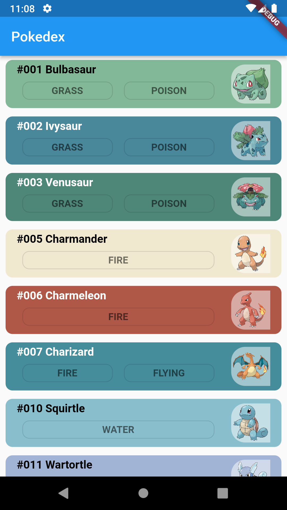
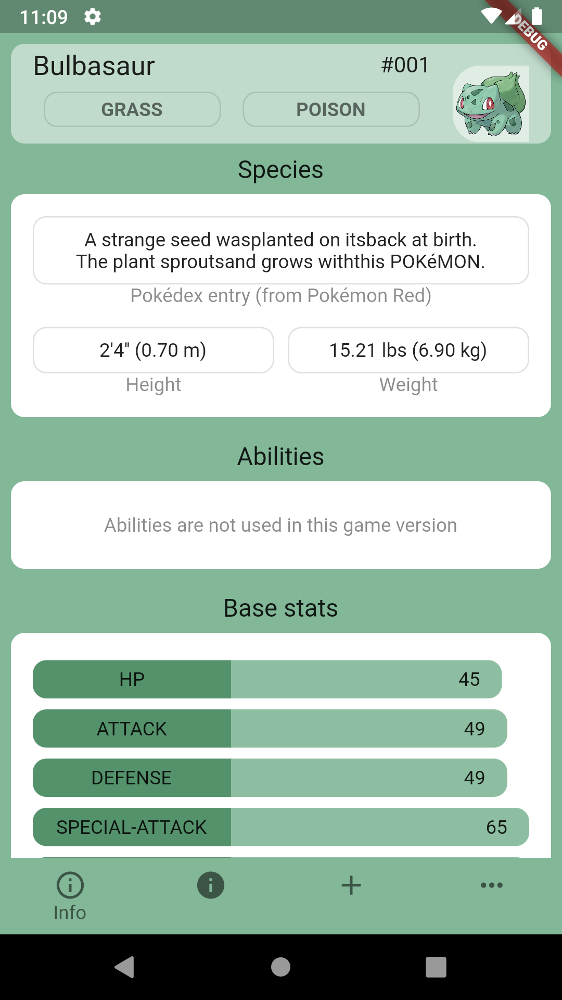
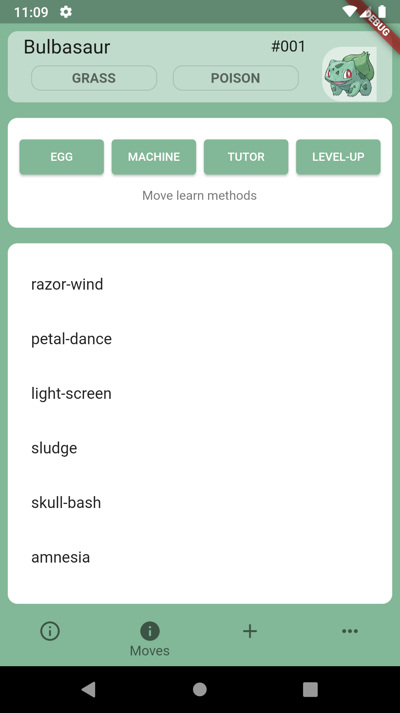
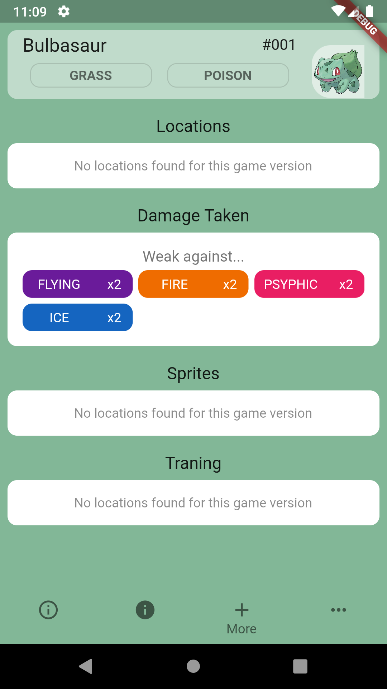
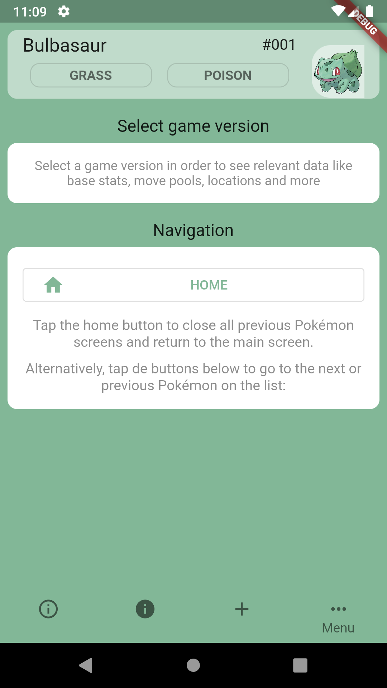

# poke_flutter
## features
* Infinite scroll home page
* Pokemon detail page organized in tabs
* Detail page themed by pokemon sprite color 
## screenshots
### Home page

### Detail page tab 1

### Detail page tab 2

### Detail page tab 3

### Detail page tab 4

## credits
* All data is provided by [pokeapi](https://pokeapi.co/)
* Design is inspired by [dataDex](https://play.google.com/store/apps/details?id=com.talzz.datadex)